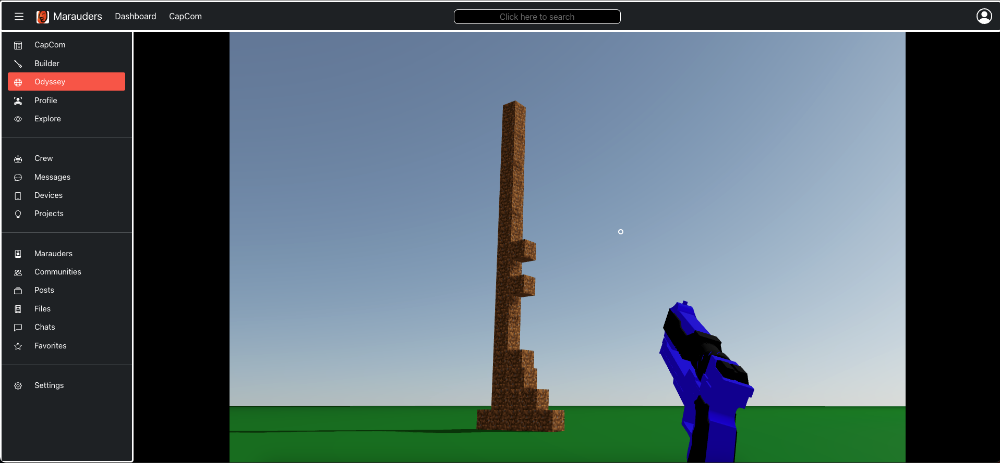

  
  <h3>Marauders is a web application that provides you with the tools to develop 3D and Augmented Reality objects. Add a device to control the tools while you're at it or add a device to keep track of things in your home. Use your creativity and the sites tools and guides to create your own world that can be shared with the community.</h3>

   [See it here](https://marauders.vercel.app)

  ---

  ## Description:

  Marauders is an application developed to learn three dimensional objects and Internet of things. Marauders no longer have to work alone. With this web application and it's community and AI, marauders can develop quicker than before. Create a plan, use your handy crew memebers to look up vital information, and come up with inspiration and blueprints.

  Marauders is also a social media platform, so when you are done creating you can share it with the world. You can also look to your peers for inspiration and leave them feedback on their projects turned reality with the help of this web application.  Join communities to work together and discover the undiscovered.

  Marauders and your crew members are also great for just messing around and indulging in what the future has to bring.

## Table of Contents:

  * [Technologies Used](#technologies-used)
  * [Images](#images)
  * [Usage](#usage)
  * [Design](#design)
  * [License](#license)
  * [Contact](#contact)

## Technologies Used

 
 
 
 
 
 
 
 

## Images

### Key Utilities

   <table>
   <tr>
      <td>Landing Page</td>
      <td>Solar System</td>
   </tr>
   <tr>
      <td style="width: 50%;"></td>
      <td style="width: 50%;"></td>
   </tr>
   </table>

### Other Utilities

   <table>
   <tr>
      <td>Builder</td>
      <td>Editor</td>
   </tr>
   <tr>
      <td style="width: 50%;"></td>
      <td style="width: 50%;"></td>
   </tr>
   </table>

## Usage:

Projects: 

Use your personal AI to find answer's to your curiosity and find inspiration for your projects.

Files:

Alternatively, search the application for files, answers and inspirations.

   <table>
   <tr>
      <td>Projects</td>
      <td>Files</td>
   </tr>
   <tr>
      <td style="width: 50%;"></td>
      <td style="width: 50%;"></td>
   </tr>
   </table>

## License: 

    
  Licensed under MIT License.

## Contact:

### Bleh Seton

bseton@gmail.com

